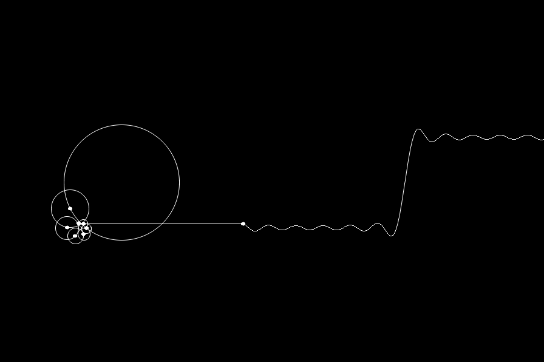

# Fourier Series Visualization



## Usage

```
$ make
$ ./fourier-series-viz
```

### Keybindings

* `Esc`, `q`: quit
* `j`/`k`, `-`/`=`: less/more circle
* `p`, `Space`: pause

### Dependencies

* [SDL2](https://libsdl.org)
* [SDL2\_gfx](https://www.ferzkopp.net/wordpress/2016/01/02/sdl_gfx-sdl2_gfx/)
